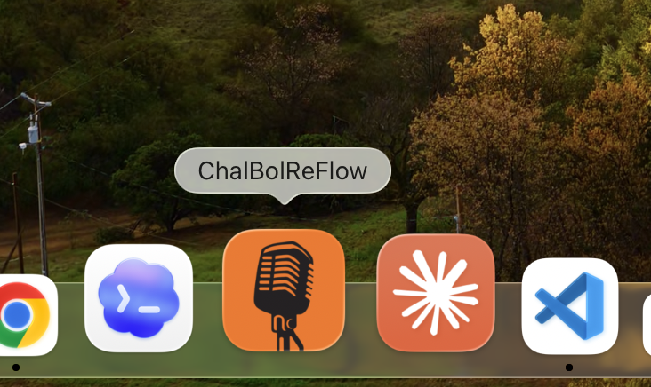
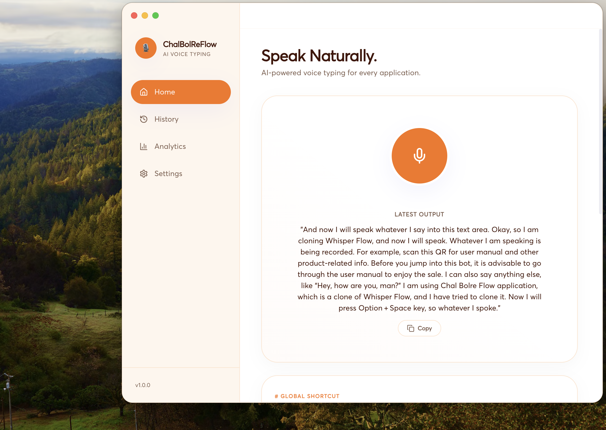
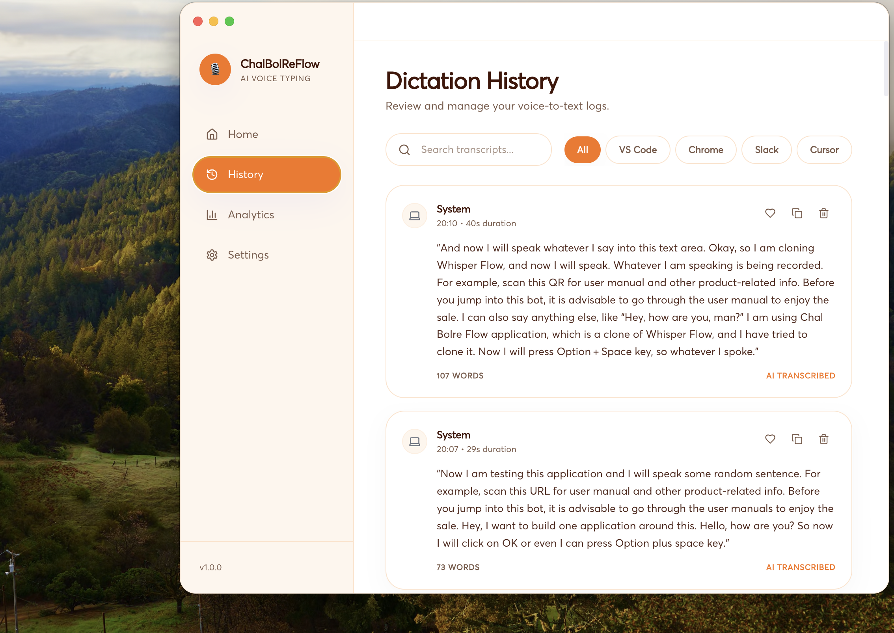
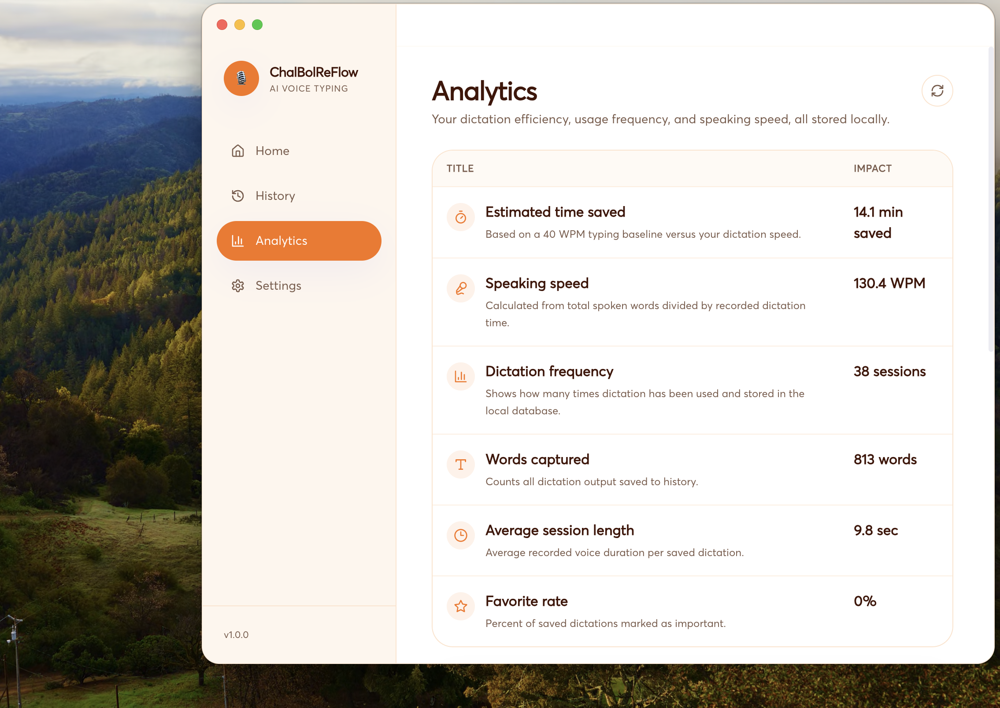
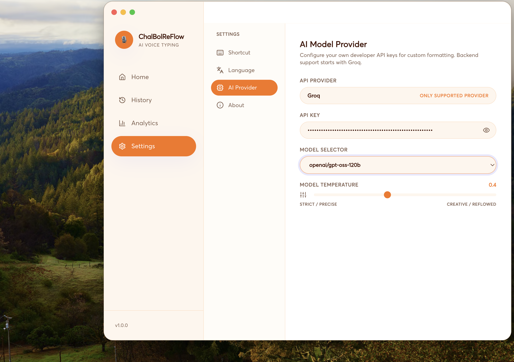

# 🎙️ ChalBolReFlow

An AI-powered desktop voice dictation application built with **Electron**, **React**, and **FastAPI**. Press a shortcut, speak naturally, and instantly convert your speech into polished text using modern LLMs.

---

## 🎥 Demo

> **Click the image below to watch the demo video.**

[](previews/demo.mp4)

---

## 📸 Screenshots

<p align="center">
  
  <br><br>
  
  <br><br>
  
  <br><br>
  
  <br><br>
  
</p>

---

# 🚀 Getting Started

## Install Dependencies

From the project root:

```bash
npm run install:desktop
```

---

## Run the Application

```bash
npm run dev
```

This automatically:

- Starts the Electron application
- Launches the FastAPI backend
- Selects the configured localhost port
- Falls back to a free port if necessary

---

## Configure Your API Key

Open:

**Settings → AI Provider → API Key**

Paste your Groq API key and save.

You're now ready to start dictation.

---

## Run in Background

To launch the application detached from the terminal:

```bash
npm run open
```

To stop it later:

```bash
npm run stop
```

---

## Run Backend & Desktop Separately

```bash
npm run dev:backend
npm run dev:desktop
```

---

# 📦 Build Desktop App

Create production installers:

```bash
npm run dist
```

Platform-specific builds:

```bash
npm run dist:mac
npm run dist:win
npm run dist:linux
```

The build process:

- Builds the React frontend
- Compiles the FastAPI backend using PyInstaller
- Bundles everything with Electron Builder
- Produces native desktop installers (`.dmg`, `.exe`, `.AppImage`)
